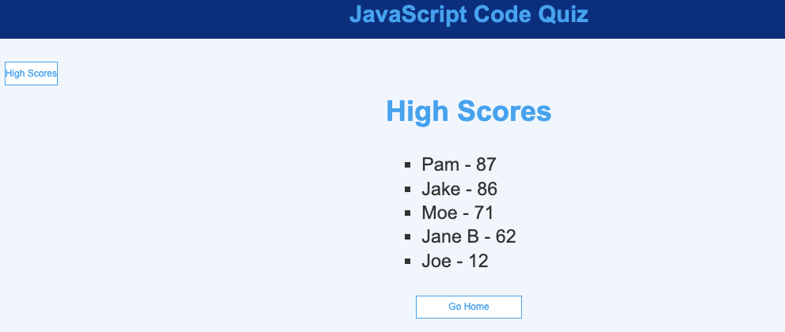

# JavaScript Quiz 
# Description: 
Coding Bootcamp Project: This 90 second JavaScript Quiz consist of 5 questions. Upon selecting the correct answer, the selection turns green and 20 points are added to the score. An incorrect selection turns red and 10 points are deducted from the score. An incorrect selection will also deduct 10 seconds from the timer (this feature is currently pending).
# Mock-Up

### Link to deployed site:
https://gordonlc18.github.io/javascript-quiz/index.html
## Contributor:
Latravia Gordon © 2022 All Rights Reserved. 